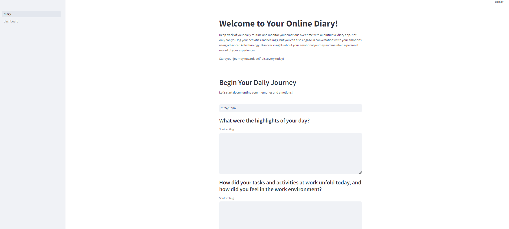
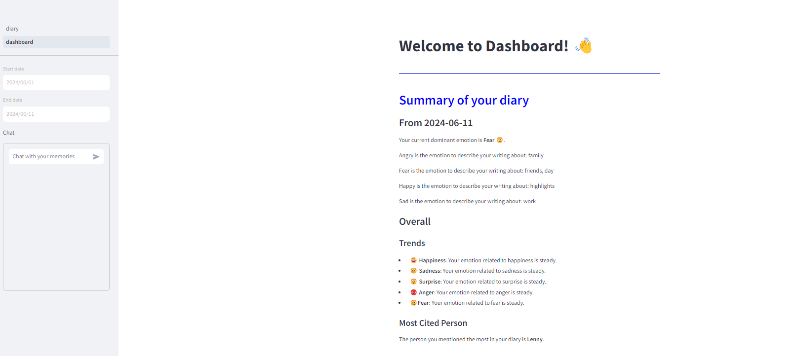
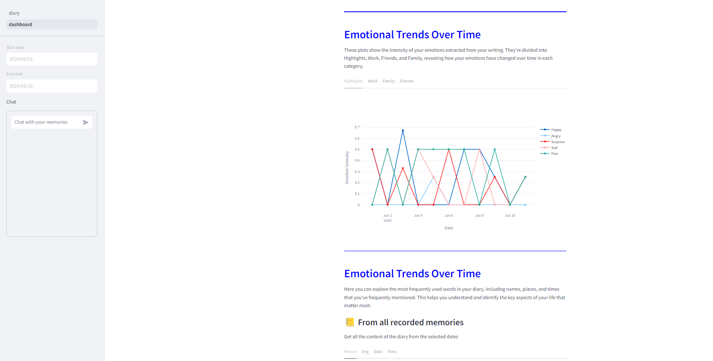

# llm-diary

Welcome to the Emotion Diary project! This Python application allows users to record their daily memories and interact with them through a chat interface powered by GenAI. The project leverages OpenAI's language models (LLM) for natural language processing tasks, and utilizes Streamlit for creating an interactive dashboard.

## Features

- **Recording Memories**: Users can log their daily memories, including emotions, activities, and interactions.
- **Emotion Analysis**: The application analyzes recorded memories to determine emotional strength over time.
- **Chat with Memories**: Utilize GenAI to chat with recorded memories, reflecting on past experiences.
- **Dashboard**: View summaries and insights about recorded memories, including common words and emotional trends.

## Technologies Used

- **OpenAI LLM**: For natural language understanding and conversation generation.
- **GenAI**: Powers the chat functionality with recorded memories.
- **NLP**: Utilized for sentiment analysis and keyword extraction.
- **Streamlit**: Framework used for building the interactive dashboard.
- **Pandas**: Library for data manipulation and analysis.

## Usage

1. Start by recording your daily memories using the provided interface.
2. Explore the dashboard to visualize emotional trends, common words, and other insights.
3. Engage in conversations with your recorded memories using the GenAI-powered chat.

## License

This project is licensed under the MIT License - see the LICENSE file for details.
